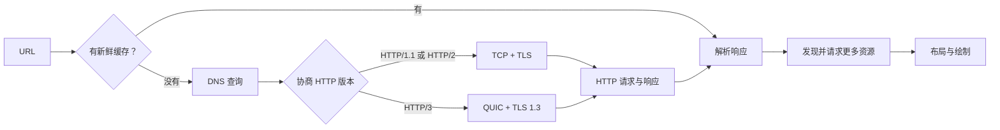

:::slide {"kind":"prose","chapter":"question","eyebrow":"THE QUESTION / ONE URL"}
## 一个 URL 不是一个网页

在地址栏输入 `https://example.com/guide?lang=zh#part`，按下回车。我们习惯把接下来发生的事概括成一句话：**浏览器向服务器发送 HTTP 请求，服务器把网页返回来。**

这句话没有错，却把最值得理解的部分全部折叠了。浏览器此时只有一段地址。它还要判断能否复用旧结果、把域名变成 IP 地址、建立可用且安全的连接，然后才轮到 HTTP 表达“我想要什么”。收到响应以后，浏览器还要继续解析和渲染，屏幕上才会真正出现页面。

所以先不要急着问 HTTP 请求长什么样。更好的第一个问题是：**浏览器从这个 URL 里得到了哪些线索？**

:::detail

URL 中的几部分承担着不同职责：

- `https` 是方案，说明这里预期使用安全的 HTTP 通信；
- `example.com` 是主机名，帮助浏览器找到通信对象；
- `/guide?lang=zh` 会参与构造请求目标；
- `#part` 是片段，通常只用于客户端定位，不会作为 HTTP 请求目标发送给服务器。

URL 描述的是资源的位置与访问方式，不是已经建立好的连接，也不是资源本身。正因为这几件事彼此独立，后面才需要一层一层把它们连接起来。

:::
:::

:::slide {"kind":"prose","chapter":"question","eyebrow":"BEFORE THE NETWORK / CACHE"}
## 缓存可能让网络根本不发生

浏览器不一定立刻访问网络。它可能已经保存过这个 URL 对应的响应，并且那份响应仍然足够新鲜。此时浏览器可以直接复用它，不必再次联系源站。

如果缓存已经过期，也不代表必须重新下载完整内容。浏览器可以带上验证条件询问服务器：我手里的版本还能不能用？服务器若回答“没有变化”，浏览器继续使用本地内容，只支付一次较小的确认成本。

这说明一次页面访问的第一条分岔并不是 HTTP/1.1、HTTP/2 还是 HTTP/3，而是：**现有结果能不能继续使用？**

:::detail

HTTP 缓存把响应分成两种重要状态：

- **新鲜**：在有效期内，可以直接复用；
- **陈旧**：通常需要重新验证，确认后才能继续复用。

`Cache-Control`、`Expires`、`ETag` 和 `Last-Modified` 等字段共同参与这个判断。缓存并不只是“省流量”的附加功能，它直接改变了主链路：有时网络请求被完全跳过，有时完整响应被一次验证替代。

:::
:::

:::slide {"kind":"flow","chapter":"route","eyebrow":"DNS / FROM NAME TO ADDRESS"}
## 名字先变成地址

人更容易记住 `example.com`，网络通信却需要可以路由的 IP 地址。DNS 负责在两者之间建立联系。

1. 读取主机名 — 浏览器从 URL 中取出 `example.com`
2. 查询已有答案 — 浏览器、操作系统和解析器都可能保存 DNS 缓存
3. 询问解析器 — 没有可用缓存时，由递归解析器继续寻找权威答案
4. 获得地址记录 — 浏览器最终得到一个或多个可尝试连接的 IP 地址

:::detail

常见示意图会画成“浏览器依次询问根服务器、顶级域服务器、权威服务器”，但真实链路通常不是这样。浏览器先把问题交给本机或网络配置中的解析器；递归解析器只有在自己的缓存不足时，才会沿着委派关系继续查询。

DNS 答案还带有生存时间（TTL）。在 TTL 允许的范围内复用答案，正是为什么根服务器和权威服务器不需要参与每一次页面访问。

得到 IP 地址也不代表已经找到唯一一台机器。同一个域名可能返回多个地址，后续还可能经过负载均衡、CDN 或代理。但对浏览器来说，下一步已经明确：尝试与其中一个网络端点建立通信。

:::
:::

:::slide {"kind":"matrix","chapter":"route","eyebrow":"LAYERS / DIFFERENT QUESTIONS"}
## 有了 IP，还没到 HTTP

| 层次 | 它回答的问题 | 常见协议 |
| --- | --- | --- |
| 名字解析 | 对方的地址是什么？ | DNS |
| 网络传递 | 数据包怎样到达那个地址？ | IP |
| 端到端传输 | 两端怎样可靠、有序或并发地传数据？ | TCP、QUIC |
| 安全通信 | 我连的是谁？内容能否被窃听或篡改？ | TLS |
| 应用语义 | 我要什么资源？结果是什么？ | HTTP |

:::detail

这些层次不是为了背诵协议栈，而是为了防止把不同问题混在一起。

IP 让数据包能够跨网络到达目标地址，但不保证一段应用数据会完整、有序地出现。TCP 在两个端点之间提供可靠、有序的字节流。QUIC 建立在 UDP 之上，却不是简单地“把 TCP 换成 UDP”：它自己提供可靠传输、拥塞控制和彼此独立的多条流，并把 TLS 1.3 的安全握手纳入连接建立过程。

HTTP 位于这些能力之上。它关心请求方法、目标资源、字段、状态码和内容，却不负责查询域名，也不负责决定一个丢失的数据包怎样重传。

:::
:::

:::slide {"kind":"prose","chapter":"route","eyebrow":"CONNECTION / SECURITY"}
## 安全连接怎么建立

对常见的 HTTPS 页面，HTTP/1.1 和 HTTP/2 通常先建立 TCP 连接，再通过 TLS 握手确认服务器身份、协商密码参数并产生共享密钥。之后的 HTTP 内容才会在加密通道中传输。

HTTP/3 走的是另一条路：它运行在 QUIC 之上，而 QUIC 把 TLS 1.3 握手整合进连接建立。两条路线的目标相同，都是先得到一条可承载 HTTP、且能确认身份和保护内容的通信通道。

因此，“HTTPS 就是在 HTTP 外面加密”只描述了结果。TLS 不只隐藏内容，还要提供身份认证和完整性保护：浏览器需要知道自己没有把密码发给冒充目标网站的人，也需要发现数据在途中是否被修改。

:::detail

TLS 握手的轮次会随协议版本、会话恢复和网络状态变化。TLS 1.3 的完整握手通常能在一个往返内完成密钥协商；恢复连接还可能使用 0-RTT 提前发送部分应用数据，但 0-RTT 的抗重放能力更弱，并不适合所有请求。

这也是为什么不能把“TLS 固定需要两次往返”当成今天所有 HTTPS 连接的通则。理解职责比记住一个容易过时的次数更重要。

:::
:::

:::slide {"kind":"code","chapter":"exchange","eyebrow":"HTTP / REQUEST AND RESPONSE","caption":"一次简化的 HTTP/1.1 文本交换。HTTP/2 与 HTTP/3 的线上编码不同，但表达的应用语义仍然相近。"}
## 请求与响应终于出现

连接可用以后，浏览器才能明确表达：使用什么方法，请求哪个目标，还附带哪些条件。服务器则用状态码、响应字段和可选内容说明处理结果。

```http
GET /guide?lang=zh HTTP/1.1
Host: example.com
Accept: text/html

HTTP/1.1 200 OK
Content-Type: text/html; charset=utf-8
Cache-Control: max-age=3600
Content-Length: 1240

<!doctype html>
...
```

:::detail

请求中的 `GET` 是方法，表示客户端希望获取资源的当前表示；`/guide?lang=zh` 是请求目标；`Host` 和 `Accept` 等字段补充目标主机与客户端偏好。

响应中的 `200` 是状态码，表示请求成功；`Content-Type` 说明响应内容应怎样解释；`Cache-Control` 告诉浏览器这份结果怎样复用。空行之后才是消息内容，而且并非每个响应都必须带内容。

所以 HTTP 不是“下载网页的格式”，而是一套请求与响应的应用语义。同样的语义可以承载 HTML、JSON、图片，也可以表达重定向、缓存验证、权限失败或服务器错误。

:::
:::

:::slide {"kind":"matrix","chapter":"evolution","eyebrow":"HTTP VERSIONS / SAME SEMANTICS"}
## 版本改变的是运输方式

| 版本 | 连接上的主要做法 | 最值得注意的限制或改进 |
| --- | --- | --- |
| HTTP/1.1 | 默认复用持久 TCP 连接 | 同一连接上的响应顺序容易限制并发，浏览器常开多条连接 |
| HTTP/2 | 把消息拆成帧，在一条 TCP 连接上复用多条流 | 应用流可并发，但 TCP 丢包仍会暂时阻塞整条连接的数据 |
| HTTP/3 | 把 HTTP 映射到 QUIC 的多条流 | 一条流的数据丢失，不再阻塞其他流继续交付 |

:::detail

协议演进没有推翻 `GET`、状态码或缓存字段这些 HTTP 语义，主要变化发生在消息怎样编码、怎样复用连接，以及丢包时不同请求会不会互相等待。

HTTP/1.1 已经默认支持持久连接，并不是每个请求都必须重新握手。但一条连接上的并发能力有限。HTTP/2 用二进制帧和流解决了应用层排队问题，不过所有流仍共享一条 TCP 字节流；底层某个包丢失时，后续字节必须等待重传。HTTP/3 借助 QUIC 的独立流，把这种跨流等待缩小到发生丢失的那条流。

因此，HTTP/3 不能概括为“HTTP 改用 UDP”。准确说法是：HTTP/3 运行在 QUIC 上，而 QUIC 以 UDP 数据报为基础，重新提供了 HTTP 所需的安全、多路复用与可靠传输能力。

:::
:::

:::slide {"kind":"flow","chapter":"arrival","eyebrow":"BROWSER / AFTER HTML"}
## 收到 HTML 只是开始

第一份 HTML 响应通常不是完整页面，而是一张继续工作的说明书。

1. 解析 HTML — 浏览器逐步构建 DOM，并从标记中发现外部资源
2. 继续请求 — 样式表、脚本、字体和图片可能触发更多 HTTP 交换
3. 计算页面 — CSS 与 DOM 共同影响布局，脚本还可能再次修改内容
4. 绘制结果 — 浏览器把计算后的像素提交到屏幕，用户才真正看见页面

:::detail

真实浏览器会并行推进很多工作：HTML 还没下载完时就可能开始解析和预加载；CSS 会影响渲染，脚本可能阻塞解析，也可能通过 `defer`、`async` 或模块机制改变执行时机。这里的四步只是帮助我们抓住主线，不代表浏览器严格串行执行。

关键结论是：**打开一个网页通常不是一次 HTTP 请求，而是一张不断展开的依赖图。** 首个文档返回后，浏览器发现更多资源；这些资源又可能命中缓存、进行 DNS 查询、复用已有连接，或建立新的连接。

:::
:::

:::slide {"kind":"flow","chapter":"arrival","eyebrow":"THE WHOLE PATH / ONE MAP"}
## 把整条链路放在一起

1. 检查结果 — 先判断已有响应能否直接复用或重新验证
2. 找到地址 — 缓存不足时，通过 DNS 把主机名解析为 IP 地址
3. 建立通道 — HTTP/1.1、HTTP/2 使用 TCP 与 TLS，HTTP/3 使用集成 TLS 1.3 的 QUIC
4. 从交换到页面 — HTTP 返回结果，浏览器继续请求依赖资源并完成布局与绘制

:::detail



这张图仍然省略了代理、CDN、连接复用、重定向、服务工作线程和浏览器的大量优化，但它保留了最重要的边界：**地址负责定位，传输负责通信，TLS 负责信任与保护，HTTP 负责表达请求和结果，浏览器负责把结果变成页面。**

图中的“协商 HTTP 版本”是概念上的分岔，不表示浏览器总要先额外发送一次独立请求。实际协商可能发生在 TLS 的 ALPN 中，也可能通过先前获得的信息尝试 HTTP/3；连接失败时，浏览器还会选择其他可用路线。

同样，缓存命中以后也不是直接“出现页面”。浏览器只是省去了远端网络交换，仍要解析保存的响应，并继续处理它引用的其他资源。

:::
:::

:::slide {"kind":"closing","chapter":"review","eyebrow":"REVIEW / FIVE QUESTIONS"}
## 下一次，不要只看见一个请求

> 打开网页，不是一条请求抵达一台服务器，而是一组职责不同的系统接成一条链。

RESULT → ADDRESS → CHANNEL → EXCHANGE → PRESENTATION

:::detail

当网页加载变慢或失败时，可以按五个问题重新走一遍：

1. **结果** — 浏览器有没有可直接使用或可验证的缓存？
2. **地址** — 域名有没有解析到合适的 IP 地址？
3. **通道** — TCP 或 QUIC 连接有没有建立，TLS 身份验证是否成功？
4. **交换** — HTTP 请求表达了什么，响应状态、字段和内容是什么？
5. **呈现** — 浏览器是否还在等待其他资源、执行脚本或计算页面？

“按下回车”不是一个动作触发一条请求，而是把一组职责不同的系统接成一条链。理解这条链以后，DNS 错误、证书错误、`404`、缓存未更新和页面白屏就不再是同一种模糊的“网站打不开”，而会落回各自真正发生问题的位置。

### 继续阅读

- [RFC 9110：HTTP Semantics](https://www.rfc-editor.org/rfc/rfc9110)
- [RFC 9111：HTTP Caching](https://www.rfc-editor.org/rfc/rfc9111)
- [RFC 9112：HTTP/1.1](https://www.rfc-editor.org/rfc/rfc9112)
- [RFC 9113：HTTP/2](https://www.rfc-editor.org/rfc/rfc9113)
- [RFC 9114：HTTP/3](https://www.rfc-editor.org/rfc/rfc9114)
- [RFC 8446：TLS 1.3](https://www.rfc-editor.org/rfc/rfc8446)
- [RFC 9000：QUIC](https://www.rfc-editor.org/rfc/rfc9000)
- [RFC 1034：Domain Names](https://www.rfc-editor.org/rfc/rfc1034)

:::
:::
