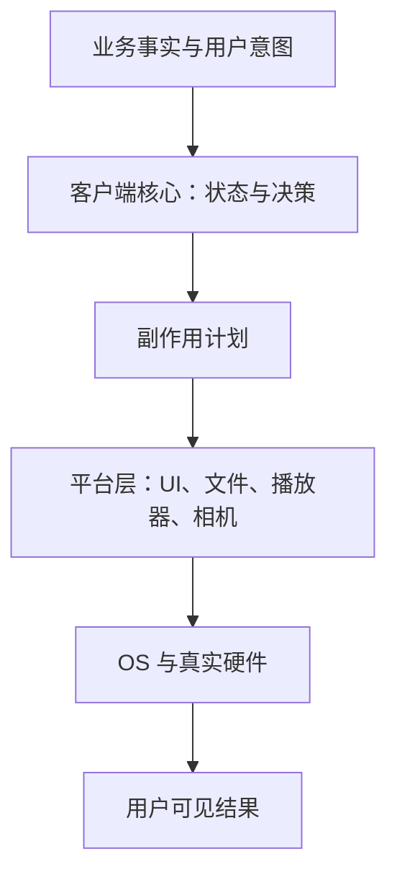

## 先看一个看起来完全相同的测试

假设我们要验证一件很简单的事：

> 用户点击“播放下一页”后，下一页出现并开始播放。

在 Web 页面里，自动测试大致可以这样表达：

```text
找到“播放下一页”按钮
→ 点击
→ 等待“第 2 页”节点出现
→ 断言它处于播放状态
```

到了原生客户端，脚本表面上也能写成同样四步。ADB、HDC、XCUITest 等工具都能点击屏幕，也能查找一部分 UI 节点。可一旦测试失败，两者面对的问题并不相同。

Web 测试通常还能继续回答：按钮是否存在、是否可见、是否被遮挡、请求是否发出、页面结构如何变化、错误发生在哪一步。客户端测试却可能只留下一个结果：20 秒内没有看到预期画面。

这时真正的原因可能是：

- 业务状态没有提交；
- UI 已经切换，但播放器仍在准备；
- 播放器已准备，但 Surface 没有挂载；
- 系统权限弹窗挡住了页面；
- App 从后台恢复时丢失了一次回调；
- 设备太慢，首帧超过了测试的等待时间；
- 上一条测试留下了账号、缓存或草稿状态。

所以问题从来不只是“能不能自动点击”。真正决定自动测试是否可靠的是：测试能否看懂系统、控制条件、等待正确的完成信号、恢复干净状态，并在失败后留下足够证据。

## Web 并不是把所有计算都交给后端

一种常见解释是：Web 容易测试，因为计算都在服务端；客户端难测试，因为计算发生在手机上。

这个说法只对了一半。Web 同样会在用户设备上运行 JavaScript、执行布局、绘制动画、解码视频，甚至通过 WebGL 和 WebAssembly 使用大量本地算力。真正的差异不是“有没有本地计算”，而是本地计算和真实硬件之间隔着什么。

Web 应用通常面对的是：

```text
DOM + CSS + JavaScript + Browser API
```

浏览器再把这些抽象转换成操作系统窗口、GPU 指令、网络连接、音视频解码和输入事件。对自动测试来说，浏览器不只是网页的运行容器，还是一套高度标准化的**验证运行时**。

原生客户端则更接近真实执行环境：

```text
业务代码
→ 平台 Framework
→ Native Library
→ 系统服务
→ Driver
→ 真实硬件
```

它因此能直接使用相机、编解码器、文件系统、通知、后台任务和传感器，也必须承担这些能力带来的设备差异、资源竞争和生命周期不确定性。

更准确地说：

> Web 的优势不是没有客户端环境，而是浏览器替应用标准化了很大一部分客户端环境。

## 浏览器天然提供了五个条件

Web 自动测试今天看起来顺手，并不只是 Playwright 的 API 写得漂亮，而是浏览器和测试工具共同提供了五个重要条件。

| 条件 | Web 中常见的能力 | 原生客户端常见的缺口 |
| --- | --- | --- |
| 可观察 | DOM、ARIA、URL、请求、Console、Storage | 自绘、Surface、相机和播放器可能只剩像素 |
| 可控制 | 拦截请求，设置 Cookie、权限、时间和浏览器状态 | 很多状态属于 OS、硬件、其他 App 或真实服务端 |
| 可同步 | 元素可见、稳定、可点击后再操作，断言自动重试 | 后台线程、Native 回调、首帧和动画不在统一视野内 |
| 可复位 | 创建全新的 BrowserContext，快速隔离 Cookie 和 Storage | 清数据、重装、授权、登录、下载资源和准备账号成本高 |
| 可诊断 | 操作、DOM 快照、截图、网络和 Trace 可以放在一起 | App 日志、系统日志、截图、性能 Trace 和业务状态彼此分散 |

例如，[Playwright 的自动等待](https://playwright.dev/docs/actionability)会在点击前检查目标是否唯一、可见、稳定、能够接收事件并且可用；断言也可以自动重试。测试不必到处猜测应该 `sleep(1000)` 还是 `sleep(3000)`。

[BrowserContext](https://playwright.dev/docs/browser-contexts)又让每条测试获得近似无痕窗口的独立环境，Cookie、Local Storage 和 Session Storage 不会自然泄漏给下一条测试。失败后，[Trace Viewer](https://playwright.dev/docs/trace-viewer)还能把操作时间线、页面快照和截图等信息放在同一个调试入口中。

因此 Web 自动化拥有的是一条完整反馈链：

```text
读取结构化页面
→ 执行动作
→ 等待可操作或业务结果
→ 读取结构化结果
→ 失败后检查统一 Trace
```

浏览器本身就是 Web 的 Harness。所谓 Harness，可以先简单理解成：包住被测系统、为测试提供观察、控制、隔离和证据的一整套外部设施。

## 客户端测试多出来的不是一块屏幕，而是一个计算节点

复杂客户端并不是“服务端结果的显示器”。它自己拥有状态机、缓存、数据库、异步任务和业务流程，还会在 CPU、GPU、编解码器以及其他专用硬件上完成大量工作。

一次“播放下一页”可能真实经过：

```text
点击
→ 客户端提交目标页状态
→ 更新本地工程数据
→ 重建 UI
→ 创建或绑定 Surface
→ 初始化硬件解码器
→ 等待首帧
→ 进入播放
```

其中任一环节都可能受到操作系统调度、前后台切换、内存压力、温度、权限、机型和厂商实现影响。服务端返回正确、业务索引也正确，并不等于用户一定能看到正确画面。

这带来一个客户端特有的事实：

> 性能、时序和资源状态经常就是功能正确性的一部分。

在一个普通纯函数中，多运行 20 毫秒，结果可能仍然完全正确。在播放器或相机链路中，Surface 晚绑定、首帧超时或主线程短暂阻塞，都可能直接改变用户看见的行为。

因此一次客户端验证不能只写成：

```text
代码 + 输入 → 输出
```

它更接近：

```text
构建版本
+ 应用初始状态
+ OS 与硬件状态
+ 外部环境
+ 输入事件序列
→ 最终可观察结果
```

同一份代码在模拟器成功、某台真机失败，或者热启动成功、冷启动失败，并不矛盾。代码没变，但执行上下文变了。

## 为什么客户端自动测试更容易抖动

### 1. 机器看见的常常只是像素

浏览器里的按钮通常对应 DOM 节点，并带有文本、角色、属性和层级。原生客户端里的普通控件也能暴露无障碍信息，但 Canvas 自绘、OpenGL/Vulkan、Surface、相机预览、视频画面和复杂跨端容器，可能只向测试框架暴露一整块矩形。

Jetpack Compose 正在用 [Semantics Tree](https://developer.android.com/develop/ui/compose/testing/semantics)为 UI 补充类似的语义结构，但官方文档也指出，开发者决定暴露什么以及暴露多少。框架无法凭空知道一块自绘画面代表“当前模板”还是“播放器首帧”。

如果机器只能按坐标点击，再用整张截图猜结果，页面稍微改版、字号变化或动画晚一帧，脚本就可能失效。

### 2. “系统已经稳定”没有统一定义

点击完成后，UI 线程空闲，不代表业务已经完成。网络请求、数据库事务、Native 回调、资源下载、播放器 prepare、Surface 挂载和首帧到达，都可能还在继续。

Android 的 [Espresso Idling Resource](https://developer.android.com/training/testing/espresso/idling-resource)正是为额外异步工作建立同步信号。问题在于，这些信号需要项目主动接入：业务必须告诉测试框架“我还在忙”“我现在完成了”。浏览器能统一判断一个元素是否可点击，却无法替客户端定义“视频真正开始播放”是什么意思。

没有业务完成信号时，测试只能使用固定等待或盲目重试。等短了会误判失败，等长了又让整套测试越来越慢。

### 3. 干净状态很贵

Web 测试可以快速创建一个新 Context。客户端要真正回到已知状态，可能需要停止进程、清数据、安装正确构建、设置权限、登录测试账号、准备服务端数据、下载资源，再导航到目标页面。

模拟器和 Android 的 [Build-managed Devices](https://developer.android.com/studio/test/managed-devices)可以帮助标准化设备配置和分片执行，但模拟器仍不等于所有真实硬件。尤其涉及相机、GPU、编解码器、功耗、温度和厂商系统行为时，物理设备仍然是验证边界的一部分。

### 4. 一个失败覆盖了太长的链路

端到端测试越完整，一次失败可能跨越的模块就越多。脚本只知道“最终画面没有出现”，却不知道错误发生在业务决策、平台执行、硬件输出还是外部服务。

如果失败报告只有一张截图和一句超时，团队很快会形成一种习惯：先重跑，重跑成功就算了。测试越不可信，维护投入越少；投入越少，测试又越不可信。

### 5. 设备矩阵真实存在

客户端结果可能受到 OS 版本、厂商、机型、ABI、屏幕尺寸、刷新率、权限状态、后台策略和硬件能力影响。Web 当然也有浏览器兼容性问题，但浏览器内核已经替应用吸收了大量底层差异。

客户端团队无法在每次提交时跑完所有真机组合。它只能选择代表性环境，并接受一部分长尾问题需要在灰度和线上监控中继续发现。

## 移动端缺的不是“更会点击的 Playwright”

客户端自动化经常先投资在操作层：录制脚本、查找控件、按坐标点击。可 ADB、HDC、XCUITest 早就能够完成许多操作。真正缺少的是点击前后那套运行时能力。

一个更可靠的客户端验证系统，至少需要补齐下面五件事：

1. **语义层**：重要 UI、页面状态、播放器状态和业务事实拥有稳定、机器可读的名称。
2. **业务同步协议**：关键异步系统能回答自己是否忙、正在等待什么、何时完成、为何失败。
3. **可控入口**：测试可以注入时间、网络结果、权限、账号和初始数据，并通过 Deep Link 等方式直达目标页面。
4. **便宜复位**：使用一次性账号、确定的服务端数据、模拟器快照或可销毁的测试环境，让每条测试从已知状态开始。
5. **统一证据包**：失败时一起保存步骤、截图、录像、语义树、App 日志、系统日志、网络、业务快照、设备信息和性能 Trace。

这五件事可以概括为：

> 可观察、可控制、可同步、可复位、可诊断。

它们比“脚本能不能点到按钮”更能决定客户端自动化是否长期可用。

## 不要把所有逻辑都赶到真机上证明

客户端比 Web 难自动化，不意味着所有验证都必须接受真机的高成本。更有效的做法，是先把客户端内部拆成不同证据层。



客户端核心可以尽量设计成：

```text
结构化输入 → 确定性业务计算 → 新状态与副作用计划
```

这部分不依赖 Activity、Page、Surface 或真实设备，就可以通过大量便宜、快速的本地测试验证。真机测试只需要继续证明：平台是否正确执行了计划，用户是否看到了预期结果。

于是整个验证体系可以分层：

| 层次 | 主要证明什么 | 适合的验证方式 |
| --- | --- | --- |
| 客户端核心 | 业务决策、状态转换、不变量 | 大量本地单元与行为测试 |
| UI 与平台契约 | 状态是否正确映射为组件和副作用 | 组件测试、契约测试、单一模拟器 |
| 设备关键链路 | 生命周期、Surface、相机、播放、性能 | 少量模拟器与代表性真机 E2E |
| 真实交付 | 长尾机型、真实网络、系统组合 | 灰度、Crash/ANR、性能与业务监控 |

目标不是让每一次代码修改都跑完整真机矩阵，而是：

> 把能脱离设备证明的部分尽量变得便宜、确定，把无法脱离设备的部分压缩成少量关键链路。

## 失败报告还需要记录“当时的手机”

Web 浏览器已经替测试管理了大量运行上下文。客户端要获得类似的可复现性，就需要显式记录一次执行的完整边界：

```text
验证上下文
= 构建身份
+ 应用状态
+ 设备状态
+ 外部环境
+ 用户操作
+ 结果与证据
```

例如一次播放失败，理想报告不应只有“没有播放”，而应该能够说明：

```text
构建：commit abc123，Release，覆盖安装
设备：某机型，某 OS，前台，竖屏，内存压力正常
应用：目标页已提交，当前 Card 为 2，播放器处于 PREPARING
运行时：Surface 未挂载，首帧未到达
预期：Card 2 自动播放
实际：停留在假帧
```

这样，排查范围就从“整个客户端都可能有问题”缩小成：业务决策正确，页面选择正确，播放器已进入准备阶段，但输出表面尚未建立。

当然，不需要采集设备上的所有信息。合理原则是：只记录那些可能改变结果、帮助复现或帮助定位的变量。这样的执行上下文也可以称为 `Execution Envelope`，即一次测试真正发生时的“验证信封”。

## 最后的结论

Web 自动测试并不天然简单。它今天显得容易，是因为浏览器、DOM、调试协议和 Playwright 等工具，已经把几十年的工程投入包装成了一套统一 Harness。

原生客户端面对的则是用户拥有的边缘计算节点：应用、操作系统、硬件、网络和外部设备共同决定最终结果。手机比桌面端更极端，但桌面原生应用同样会面对进程生命周期、文件权限、GPU、音视频设备和安装升级；Electron 相对容易测试，也正是因为它重新获得了 DOM 和浏览器调试协议。

所以，客户端自动化真正要追赶的不是一套点击 API，而是浏览器背后的五种能力：

> **让系统可观察、可控制、可同步、可复位、可诊断。**

当业务决策能够脱离设备快速证明，平台副作用能够被结构化观察，少量真机链路又能产出完整证据时，客户端自动测试才会逐渐接近 Web 的反馈效率。它不会变得和 Web 完全一样便宜，但会从“脚本偶尔帮忙点一下”，变成一套团队真正敢于依赖的验证系统。
